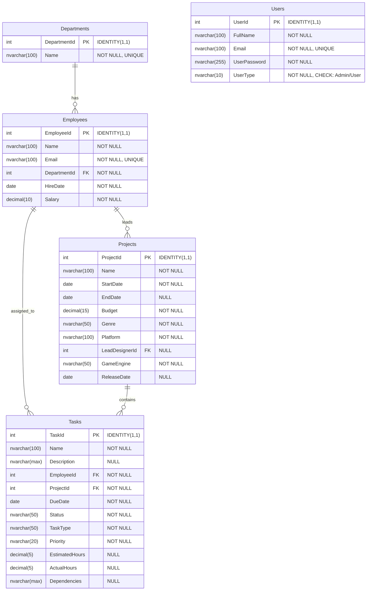

# Base de Datos erpGC - Sistema ERP para Desarrollo de Videojuegos

## Descripción General
Sistema de gestión empresarial (ERP) diseñado específicamente para una empresa de desarrollo de videojuegos. La base de datos gestiona empleados, departamentos, proyectos de juegos y tareas asociadas.

## Diagrama de Entidad-Relación

## Estructura de Tablas

### 📁 Departments
Almacena los departamentos de la empresa.
- **DepartmentId** (PK): Identificador único del departamento
- **Name**: Nombre del departamento (único)

### 👥 Employees
Información de los empleados de la empresa.
- **EmployeeId** (PK): Identificador único del empleado
- **Name**: Nombre completo del empleado
- **Email**: Correo electrónico (único)
- **DepartmentId** (FK): Referencia al departamento
- **HireDate**: Fecha de contratación
- **Salary**: Salario del empleado

### 🎮 Projects
Proyectos de videojuegos en desarrollo.
- **ProjectId** (PK): Identificador único del proyecto
- **Name**: Nombre del proyecto/juego
- **StartDate**: Fecha de inicio del proyecto
- **EndDate**: Fecha de finalización (opcional)
- **Budget**: Presupuesto asignado
- **Genre**: Género del videojuego
- **Platform**: Plataforma de destino
- **LeadDesignerId** (FK): Empleado líder del diseño
- **GameEngine**: Motor de juego utilizado
- **ReleaseDate**: Fecha de lanzamiento (opcional)

### ✅ Tasks
Tareas asignadas dentro de los proyectos.
- **TaskId** (PK): Identificador único de la tarea
- **Name**: Nombre de la tarea
- **Description**: Descripción detallada
- **EmployeeId** (FK): Empleado asignado
- **ProjectId** (FK): Proyecto al que pertenece
- **DueDate**: Fecha límite
- **Status**: Estado actual de la tarea
- **TaskType**: Tipo de tarea
- **Priority**: Prioridad de la tarea
- **EstimatedHours**: Horas estimadas
- **ActualHours**: Horas reales trabajadas
- **Dependencies**: Dependencias con otras tareas

### 🔐 Users
Usuarios del sistema con diferentes niveles de acceso.
- **UserId** (PK): Identificador único del usuario
- **FullName**: Nombre completo
- **Email**: Correo electrónico (único)
- **UserPassword**: Contraseña encriptada
- **UserType**: Tipo de usuario (Admin/User)

## Relaciones

| Tabla Padre | Tabla Hija | Tipo de Relación | Descripción |
|-------------|------------|------------------|-------------|
| Departments | Employees | 1:N | Un departamento tiene múltiples empleados |
| Employees | Projects | 1:N | Un empleado puede liderar múltiples proyectos |
| Employees | Tasks | 1:N | Un empleado puede tener múltiples tareas |
| Projects | Tasks | 1:N | Un proyecto contiene múltiples tareas |

## Características Técnicas

- **Motor de Base de Datos**: Microsoft SQL Server
- **Versión de Compatibilidad**: 160 (SQL Server 2022)
- **Collation**: DATABASE_DEFAULT
- **Modo de Recuperación**: SIMPLE
- **Query Store**: Habilitado
- **Índices**: Claves primarias clustered y únicos no-clustered en campos email

## Constrains y Validaciones

- Todos los emails deben ser únicos en sus respectivas tablas
- Los nombres de departamentos deben ser únicos
- UserType solo acepta valores 'Admin' o 'User'
- Todas las claves foráneas tienen restricciones de integridad referencial

## Uso Recomendado

Este esquema es ideal para:
- Gestión de recursos humanos en estudios de videojuegos
- Seguimiento de proyectos de desarrollo de juegos
- Asignación y monitoreo de tareas
- Control de acceso al sistema mediante usuarios

---

*Generado automáticamente desde el script de creación de base de datos*
